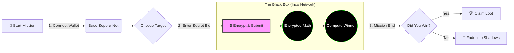
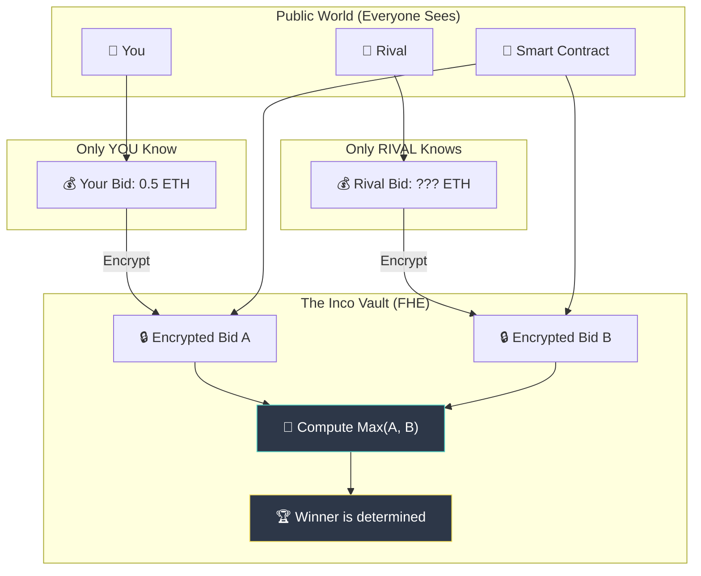

# 🕵️‍♂️ Auction Heists: The Confidential Job

> **"Where the highest bidder wins, but no one knows the price."**


---

## � Operation Coordinates (Deployment)

**Secure Channel Established.**

*   **Network:** Base Sepolia Testnet
*   **The Vault (Contract Address):** [`0x3191890599E531BdDAC9D2002152D8236478304A`](https://sepolia.basescan.org/address/0x3191890599E531BdDAC9D2002152D8236478304A)
*   **Status:** 🟢 **LIVE** & Listening

This contract is the heart of the operation. It holds the loot, accepts the encrypted bids, and mathematically determines the winner without ever revealing a single secret.

---

## 🎯 The Objective (Purpose)

**The Problem:**
On standard blockchains like Ethereum, "privacy" is a myth. Every bid you place in an auction is broadcast to the world.
*   🐋 **Whales** watch your wallet.
*   🤖 **Bots** frontrun your transactions.
*   📉 **Snipers** outbid you by a penny at the last second.

**The Solution:**
**Auction Heists** creates a cryptographic "Dark Room." We use advanced cryptography to allow you to bid blindly.
*   **No one sees your bid** (not even the developers).
*   **The highest bidder wins** fairly.
*   **Zero information leakage.**

---

## 🔐 The Tech (Inco Integration)

We didn't just hide the frontend; we revolutionized the backend. This project is built on the **Inco Network**, an EVM-compatible Layer 1 that brings **Fully Homomorphic Encryption (FHE)** to smart contracts.

### How Inco is Incorporated:

1.  **Encrypted Data Types (`euint256`)**:
    Instead of storing your bid as a regular number (`uint256`), we store it as an `euint256`. This is a black box that *contains* your number but cannot be opened by anyone without the key.

2.  **Blind Computation**:
    Normally, to find the highest number, you need to see all the numbers. **Inco's FHEVM** allows the smart contract to perform math on encrypted data.
    *   *Question:* "Is Encrypted Bid A > Encrypted Bid B?"
    *   *Answer:* "Yes" (but we still don't know what A or B actually are).

3.  **The Black Box Execution**:
    All logic happens on-chain. There is no off-chain server or "trusted" party holding the keys. The keys are distributed across the network validators using Threshold FHE.

---

## 🌍 The Significance

Why does this matter? This isn't just a game; it's a blueprint for the future of privacy.

*   **MEV Protection**: Since the bid amount is encrypted, searcher bots cannot calculate the profit of frontrunning you. The "extraction value" is hidden.
*   **True Digital Sealed-Bids**: For the first time, we have a decentralized equivalent of a sealed envelope. This unlocks use cases for real estate, government tenders, and corporate procurement.
*   **Fairness**: Wealth doesn't reveal strategy. A small player can outmaneuver a whale because the whale doesn't know the price to beat.

---

## 🗺️ The Heist Flow

How a typical operation goes down:



---

## 🛡️ The Privacy Shield (Visualized)

Traditional blockchains are public. Everyone sees everything. **Inco** is different. It's like computing inside a locked vault.



---

## 🧰 The Toolkit (Tech Stack)

*   **Network:** Base Sepolia (Testnet)
*   **Secret Sauce:** Inco FHEVM (Fully Homomorphic Encryption)
*   **Frontend:** Next.js + Tailwind CSS (The "Heist" Dashboard)
*   **Smart Contract:** Solidity (The Rules of Engagement)

---

## 🚀 Quick Start (Join the Crew)

Ready to start your first job?

1.  **Clone the Repo**:
    ```bash
    git clone https://github.com/yourusername/auction-heists.git
    cd auction-heists
    ```

2.  **Install Dependencies**:
    ```bash
    # Backend (The Contract)
    cd backend && npm install
    
    # Frontend (The Interface)
    cd ../frontend && npm install
    ```

3.  **Run Locally**:
    ```bash
    # Terminal 1: Frontend
    cd frontend && npm run dev
    
    # Terminal 2: Interact
    cd backend && npx hardhat run scripts/startAuction.js --network baseSepolia
    ```

4.  **Access the Safehouse**: Open `http://localhost:3000`
