# 🎯 Auction Heists - Confidential On-Chain Auctions with FHE

> **First fully on-chain confidential auction game powered by Inco's Fully Homomorphic Encryption (FHEVM)**

A revolutionary auction platform where **bids remain secret forever**. Players compete for exclusive NFT loot through sealed-bid auctions where privacy isn't just a feature—it's mathematically guaranteed.

[](https://nextjs.org/)
[](https://soliditylang.org/)
[](https://inco.org/)
[](LICENSE)

🔗 **Live Contract**: [`0x3191890599E531BdDAC9D2002152D8236478304A`](https://sepolia.basescan.org/address/0x3191890599E531BdDAC9D2002152D8236478304A) (Base Sepolia)


---

## 📖 Table of Contents

- [What is Auction Heists?](#-what-is-auction-heists)
- [Real-World Significance](#-real-world-significance)
- [How Inco Powers This Project](#-how-inco-powers-this-project)
- [Why Inco is the Perfect Fit](#-why-inco-is-the-perfect-fit)
- [Architecture & Data Flow](#-architecture--data-flow)
- [Smart Contract Overview](#-smart-contract-overview)
- [Quick Start](#-quick-start)
- [Features](#-features)

---

## 🎮 What is Auction Heists?

**Auction Heists** is a confidential auction game where players submit **encrypted bids** for exclusive NFT "heist loot" in fast-paced 5-minute rounds. Unlike traditional auctions:

- 💰 **Bid amounts are encrypted** and remain secret forever
- 🏆 **Winners are computed privately** using Fully Homomorphic Encryption (FHE)
- 🔒 **Losing bids are never revealed** - not during, not after, never
- ⚡ **No frontrunning possible** - encrypted bids prevent MEV attacks
- 🎨 **NFT rewards** are automatically minted to winners

### The Problem We Solve

Traditional on-chain auctions suffer from:
- **Privacy leak**: All bids are publicly visible
- **Frontrunning**: Bots can see and outbid you
- **Strategic manipulation**: Players adjust bids based on others
- **Post-auction exposure**: Losing bids become public knowledge

**Auction Heists** eliminates these through FHE-powered confidentiality.

---

## 🌍 Real-World Significance

### Day-to-Day Applications

While Auction Heists is a game, the underlying technology has profound real-world implications:

#### 1. **Private Marketplaces**
- **Real Estate Auctions**: Buyers can bid without revealing their budget to competitors
- **Art & Collectibles**: Protect buyer privacy in high-value transactions
- **Government Procurement**: Prevent bid rigging and collusion

#### 2. **Financial Privacy**
- **Sealed-Bid Tenders**: Companies can submit competitive bids without information leakage
- **Private Asset Sales**: Liquidations without public price discovery manipulation
- **Dark Pool Trading**: Encrypted order books for institutional traders

#### 3. **Democratic Processes**
- **Anonymous Voting**: Secure, private voting mechanisms
- **Allocation Systems**: Fair distribution without revealing participant strategies
- **Grant Applications**: Confidential funding requests

#### 4. **Gaming & Entertainment**
- **Fair Competition**: No strategic advantage from seeing opponents' moves
- **Prize Reveals**: Surprise mechanics without centralized trust
- **Esports Betting**: Private wagers with public settlement

### Why This Matters

In traditional blockchains, **transparency = vulnerability**. Every auction bid, every trade, every decision is public. This creates:
- Information asymmetry (whales can see retail bids)
- MEV exploitation (bots frontrun transactions)
- Privacy violations (financial activities are public)

**FHE changes the game**: Computation happens on encrypted data. You get blockchain's trustlessness **plus** real-world privacy.

---

## ⚡ How Inco Powers This Project

### Inco Integration Architecture

Auction Heists leverages **Inco's FHEVM** (Fully Homomorphic Encryption Virtual Machine) to enable confidential smart contracts on Base Sepolia.


### Inco Resources Used

| Component | Purpose | Integration Point |
|-----------|---------|-------------------|
| **@inco/lightning** | FHE smart contract library | Smart contract imports (`euint256`, `ebool`) |
| **@inco/js** | Client-side encryption SDK | Frontend bid encryption |
| **euint256 Type** | Encrypted 256-bit integers | Storing bid amounts |
| **ebool Type** | Encrypted boolean values | FHE comparisons (`gt`, `eq`) |
| **FHE Operations** | Encrypted computation | `e.gt()`, `e.select()`, `e.eq()` |
| **inco.getFee()** | Gas estimation for FHE ops | Transaction fee calculation |

### Code Examples

#### Smart Contract (Solidity with Inco FHE)

```solidity
// Import Inco FHE library
import { e, ebool, euint256, inco } from "@inco/lightning/src/Lib.sol";

// Encrypted bid submission
function submitEncryptedBid(bytes calldata encryptedBid) external payable {
    Auction storage auction = auctions[currentAuctionId - 1];
    
    // Create encrypted integer from ciphertext
    euint256 bid = e.newEuint256(encryptedBid, msg.sender);
    
    // Allow contract to operate on encrypted value
    e.allow(bid, address(this));
    e.allow(bid, msg.sender);
    
    // Store encrypted bid (plaintext amount never visible)
    auction.bids[msg.sender] = bid;
}

// FHE-powered winner computation
function resolveAuction() external {
    euint256 maxBid = auction.bids[auction.bidders[0]];
    
    for (uint256 i = 1; i < auction.bidders.length; i++) {
        euint256 currentBid = auction.bids[auction.bidders[i]];
        
        // Encrypted comparison: is currentBid > maxBid?
        ebool isGreater = e.gt(currentBid, maxBid);
        
        // Encrypted selection: pick max without decryption
        maxBid = e.select(isGreater, currentBid, maxBid);
    }
    
    // Winner determined without revealing any bid amounts!
}
```

#### Frontend (React with Inco SDK)

```typescript
import { encryptValue, getFee } from "@/utils/inco";

// Encrypt bid client-side before submitting
const handleSubmitBid = async () => {
    const bidValue = parseEther(bidAmount); // User enters 0.05 ETH
    
    // Encrypt using Inco SDK
    const encryptedBid = await encryptValue({
        value: bidValue,
        address: userAddress,
        contractAddress: AUCTION_CONTRACT_ADDRESS,
    });
    
    // Get FHE operation fee
    const fee = await getFee();
    
    // Submit encrypted bid to blockchain
    await writeContract({
        address: AUCTION_CONTRACT_ADDRESS,
        functionName: "submitEncryptedBid",
        args: [encryptedBid], // Only ciphertext sent!
        value: fee,
    });
};
```

---

## 🎯 Why Inco is the Perfect Fit

### Alternative Approaches & Their Shortcomings

| Approach | Privacy Level | Trustlessness | Computation | Why Not Used |
|----------|---------------|---------------|-------------|--------------|
| **Commit-Reveal** | Medium | ✅ High | ❌ No encrypted math | Bids revealed after auction ends |
| **Zero-Knowledge Proofs** | High | ✅ High | ⚠️ Complex circuits | Cannot compute max(bid1, bid2) privately |
| **Trusted Execution Environments** | High | ❌ Trust required | ✅ Fast | Centralized trust in hardware |
| **Multiparty Computation** | High | ⚠️ Threshold trust | ⚠️ Slow | Requires coordination, network delays |
| **Inco FHE** | ✅ **Highest** | ✅ **Fully trustless** | ✅ **Encrypted operations** | ✅ **Perfect fit!** |

### Why FHE Wins

1. **True Privacy**: Bids remain encrypted on-chain, viewable only by bidder
2. **Encrypted Computation**: Find maximum bid without decryption
3. **Zero Trust**: No trusted parties, hardware enclaves, or coordinators
4. **Composability**: Works with standard smart contract calls
5. **Verifiability**: All operations happen on a public blockchain

### Inco's Unique Value

- **First-class FHE types**: `euint256`, `ebool` are native to the language
- **Comprehensive operations**: Comparison (`gt`, `eq`), selection (`select`), arithmetic
- **Developer-friendly**: Works with existing tools (Hardhat, Viem, Wagmi)
- **Gas-efficient**: Optimized FHE operations with predictable costs
- **Production-ready**: Deployed on Base Sepolia with active ecosystem

**No other solution offers encrypted computation on public blockchains this seamlessly.**

---

## 🏗️ Architecture & Data Flow

### Complete User Journey

```mermaid
sequenceDiagram
    participant User as 👤 User
    participant Wallet as 🦊 MetaMask
    participant Frontend as 💻 Next.js App
    participant Inco as 🔐 Inco SDK
    participant Contract as 📜 Smart Contract<br/>(Base Sepolia)
    participant Blockchain as ⛓️ Blockchain State

    Note over User,Blockchain: Phase 1: Wallet Connection
    User->>Wallet: Connect Wallet
    Wallet->>Frontend: Provide Address & Signer
    Frontend->>Contract: Read getCurrentAuction()
    Contract-->>Frontend: Auction Info (ID, Timer, Bidders)
    Frontend->>User: Display Auction Status

    Note over User,Blockchain: Phase 2: Submit Encrypted Bid
    User->>Frontend: Enter Bid Amount (e.g., 0.05 ETH)
    Frontend->>Inco: encryptValue(0.05 ETH, userAddress)
    Inco->>Inco: Generate FHE Ciphertext
    Inco-->>Frontend: Encrypted Bid (euint256 handle)
    
    Frontend->>Contract: getFee()
    Contract-->>Frontend: Required Fee (e.g., 0.001 ETH)
    
    Frontend->>Wallet: Request Transaction Approval
    Wallet->>User: Show Transaction (Fee + Encrypted Data)
    User->>Wallet: Approve Transaction
    
    Wallet->>Contract: submitEncryptedBid(ciphertext)
    Contract->>Contract: e.newEuint256(ciphertext, msg.sender)
    Contract->>Blockchain: Store Encrypted Bid
    Blockchain-->>Contract: Confirmation
    Contract-->>Frontend: Transaction Receipt
    Frontend->>User: ✅ Success: Bid Submitted!

    Note over User,Blockchain: Phase 3: Auction Resolution
    User->>Frontend: Wait for Timer to End
    Frontend->>Contract: resolveAuction()
    
    Contract->>Contract: Load All Encrypted Bids (euint256[])
    Contract->>Contract: FHE: maxBid = bids[0]
    
    loop For Each Bid
        Contract->>Contract: ebool isGreater = e.gt(bid[i], maxBid)
        Contract->>Contract: maxBid = e.select(isGreater, bid[i], maxBid)
    end
    
    Contract->>Contract: Find Winner (euint256 == maxBid)
    Contract->>Contract: Mint NFT to Winner
    Contract->>Blockchain: Update State (Winner, Resolved=true)
    Blockchain-->>Contract: Confirmation
    Contract-->>Frontend: Event: AuctionResolved(winner)
    
    Note over User,Blockchain: Phase 4: View Results
    Frontend->>Contract: getAuctionWinner(auctionId)
    Contract-->>Frontend: Winner Address
    Frontend->>Contract: ownerOf(tokenId)
    Contract-->>Frontend: NFT Owner = Winner
    Frontend->>User: 🏆 Show Winner & NFT Minted
    
    Note over User,Blockchain: 🔒 Privacy Guarantee
    Note right of Blockchain: Bid amounts remain<br/>ENCRYPTED FOREVER
```



### System Architecture

```mermaid
graph TB
    subgraph "🎨 Frontend Layer"
        A[Next.js 16 App]
        B[RainbowKit Wallet]
        C[Wagmi Hooks]
        D[Auction Interface UI]
    end
    
    subgraph "🔐 Encryption Layer"
        E[@inco/js SDK]
        F[encryptValue Function]
        G[getFee Function]
    end
    
    subgraph "⛓️ Blockchain Layer - Base Sepolia"
        H[AuctionHeist Contract<br/>0x3191...304A]
        I[Auction State]
        J[NFT Minting]
    end
    
    subgraph "🧮 FHE Computation"
        K[@inco/lightning Library]
        L[euint256 Operations]
        M[ebool Comparisons]
    end
    
    A --> B
    B --> C
    C --> D
    D --> E
    E --> F
    F --> H
    H --> K
    K --> L
    K --> M
    L --> I
    M --> I
    I --> J
    
    style E fill:#9f7aea,stroke:#6b46c1,color:#fff
    style K fill:#ed8936,stroke:#c05621,color:#fff
    style H fill:#48bb78,stroke:#2f855a,color:#fff
```

### Data Flow Breakdown

#### 1. **Wallet Connection → Read Auction**
```
User clicks "Connect Wallet"
↓
MetaMask provides account address
↓
Frontend calls contract.getCurrentAuction()
↓
Display: Auction ID, NFT Prize, Timer, Bidder Count
```

#### 2. **Bid Submission → Encryption**
```
User enters bid amount (plaintext)
↓
Inco SDK encrypts: encryptValue(amount, userAddress, contractAddress)
↓
Returns: Encrypted ciphertext (euint256 handle)
↓
Frontend requests transaction fee: contract.getFee()
↓
User approves transaction in MetaMask
↓
Contract receives: submitEncryptedBid(encryptedBid)
↓
Contract stores: auction.bids[msg.sender] = euint256
↓
Emit event: BidSubmitted(auctionId, bidder, encryptedBid)
```

#### 3. **Transaction → On-Chain Storage**
```
Transaction sent to Base Sepolia
↓
Contract executes: e.newEuint256(ciphertext, bidder)
↓
Store in mapping: address → euint256
↓
Allow permissions: e.allow(bid, contract), e.allow(bid, bidder)
↓
Update bidders array: auction.bidders.push(msg.sender)
↓
Transaction mined (encrypted data now on-chain)
```

#### 4. **Auction End → FHE Computation**
```
Timer reaches 0:00
↓
Operator/Anyone calls: contract.resolveAuction()
↓
Contract loads: euint256[] of all encrypted bids
↓
Initialize: maxBid = bids[0]
↓
Loop through bids:
  ├─ Compare: ebool isGreater = e.gt(bid[i], maxBid)
  └─ Update: maxBid = e.select(isGreater, bid[i], maxBid)
↓
Find winner: loop to match bid == maxBid
↓
Mint NFT: _mint(winner, tokenId)
↓
Mark resolved: auction.resolved = true
↓
Emit: AuctionResolved(auctionId, winner, tokenId)
```

#### 5. **Results → Analytics**
```
Frontend detects AuctionResolved event
↓
Call: contract.getAuctionWinner(auctionId)
↓
Returns: winner address (only data revealed)
↓
Call: contract.ownerOf(tokenId)
↓
Verify: NFT ownership matches winner
↓
Display: 🏆 Winner announcement
↓
Analytics: Total bidders, auction duration
↓
🔒 Bid amounts: STILL ENCRYPTED (never revealed)
```

---

## 📜 Smart Contract Overview

### Contract Address

**Network**: Base Sepolia Testnet  
**Address**: [`0x3191890599E531BdDAC9D2002152D8236478304A`](https://sepolia.basescan.org/address/0x3191890599E531BdDAC9D2002152D8236478304A)  
**Explorer**: [View on BaseScan](https://sepolia.basescan.org/address/0x3191890599E531BdDAC9D2002152D8236478304A)

### What the Smart Contract Does

The `AuctionHeist` contract manages confidential auctions with these core functions:

#### **Key Functions**

| Function | Access | Purpose |
|----------|--------|---------|
| `startAuction()` | Owner Only | Starts a new 5-minute auction for the next NFT |
| `submitEncryptedBid(bytes)` | Public | Submit encrypted bid (requires FHE fee) |
| `resolveAuction()` | Public | Compute winner using FHE after auction ends |
| `resolveAuctionWithWinner(id, winner)` | Owner Only | Manual resolution for multi-bidder auctions |
| `getCurrentAuction()` | View | Get current auction info (ID, timer, bidders) |
| `getAuctionWinner(id)` | View | Get winner address (only after resolution) |
| `hasBid(address)` | View | Check if address has submitted a bid |
| `getBid(id, address)` | View | Get encrypted bid handle (euint256) |

#### **Contract State**

```solidity
struct Auction {
    uint256 auctionId;          // Sequential auction number
    uint256 tokenId;            // NFT prize ID
    uint256 endTime;            // Unix timestamp
    uint256 duration;           // 300 seconds (5 minutes)
    address winner;             // Winner address (after resolution)
    euint256 highestBid;        // Encrypted max bid
    bool resolved;              // Resolution status
    mapping(address => euint256) bids;  // Encrypted bids
    address[] bidders;          // List of bidders
}
```

#### **Privacy Guarantees**

1. **Encrypted Storage**: All bid amounts stored as `euint256` (FHE ciphertext)
2. **Private Comparison**: `e.gt(bid1, bid2)` compares without decryption
3. **Private Selection**: `e.select(condition, value1, value2)` chooses without revealing
4. **Permanent Secrecy**: Losing bids never decrypted, not even after auction ends
5. **Minimal Revelation**: Only winner address revealed (not bid amount)

#### **Security Features**

- ✅ **Time-locked bidding**: Cannot bid after auction ends
- ✅ **Re-entrancy protection**: No external calls before state changes
- ✅ **Fee enforcement**: Requires FHE operation fees
- ✅ **Ownership control**: Only owner can start auctions
- ✅ **Winner validation**: Winner must be a valid bidder
- ✅ **NFT safety**: ERC721 standard compliance

---

## 🚀 Quick Start

### Prerequisites

- Node.js 18+
- MetaMask wallet
- Base Sepolia ETH (get from [faucet](https://www.coinbase.com/faucets/base-ethereum-sepolia-faucet))

### Installation

```bash
# Clone repository
git clone https://github.com/yourusername/auction-heists.git
cd auction-heists

# Install backend dependencies
cd backend
npm install

# Install frontend dependencies
cd ../frontend
npm install
```

### Configuration

```bash
# Backend .env
PRIVATE_KEY_BASE_SEPOLIA="your-private-key"
BASE_SEPOLIA_RPC_URL="https://base-sepolia-rpc.publicnode.com"
AUCTION_CONTRACT_ADDRESS="0x3191890599E531BdDAC9D2002152D8236478304A"

# Frontend .env (create if needed)
NEXT_PUBLIC_WALLETCONNECT_PROJECT_ID="your-project-id"
```

### Running Locally

```bash
# Start frontend
cd frontend
npm run dev
# → http://localhost:3000

# In another terminal, start an auction (as contract owner)
cd backend
npx hardhat run scripts/startAuction.js --network baseSepolia
```

### Testing the Auction

1. Visit `http://localhost:3000`
2. Connect your MetaMask wallet (Base Sepolia network)
3. Enter a bid amount (e.g., 0.05 ETH)
4. Click "SUBMIT ENCRYPTED BID"
5. Approve the transaction
6. Wait for confirmation
7. After 5 minutes, auction resolves automatically!

---

## ✨ Features

### 🔐 Privacy-First Design
- **FHE Encryption**: Military-grade privacy using Inco FHEVM
- **Zero Knowledge**: Operators can't see bid amounts
- **Forever Secret**: Encrypted data never decrypted

### 🎨 Heist-Themed Experience
- **Cyberpunk UI**: Dark mode with neon accents
- **Real-time Updates**: Live auction timer
- **Mission Briefing**: Narrative-driven UX

### ⚡ Production-Ready
- **Base Sepolia**: Deployed on testnet
- **Wagmi Integration**: Modern Web3 stack
- **Mobile Responsive**: Works on all devices

### 🏆 Gamification
- **NFT Rewards**: Exclusive "Heist Loot" NFTs
- **5-Minute Rounds**: Fast-paced competitive bidding
- **Leaderboard Ready**: Track multiple auctions

---

## 📊 Technology Stack

| Layer | Technology |
|-------|-----------|
| **Blockchain** | Base Sepolia (Ethereum L2) |
| **Smart Contracts** | Solidity 0.8.30 |
| **FHE Library** | @inco/lightning (FHEVM) |
| **Frontend** | Next.js 16, React 19, TypeScript |
| **Styling** | Tailwind CSS 4 |
| **Web3** | Wagmi 2, Viem 2, RainbowKit |
| **Encryption SDK** | @inco/js |
| **Development** | Hardhat, Foundry |
| **Testing** | Chai, Mocha |

---

## 🤝 Contributing

Contributions welcome! Please read our [Contributing Guide](CONTRIBUTING.md) first.

### Development Workflow

```bash
# Run tests
cd backend
npx hardhat test

# Deploy new contract
npx hardhat ignition deploy ignition/modules/AuctionHeist.ts --network baseSepolia

# Lint code
cd frontend
npm run lint
```

---

## 📄 License

This project is licensed under the MIT License - see the [LICENSE](LICENSE) file for details.

---

## 🙏 Acknowledgments

- **Inco Network**: For pioneering FHE on EVM
- **Base**: For the scalable L2 infrastructure
- **OpenZeppelin**: For battle-tested smart contract libraries

---

## 📞 Contact & Links

- **Website**: [Coming Soon]
- **Twitter**: [@AuctionHeists](#)
- **Discord**: [Join Community](#)
- **Documentation**: [View Docs](./docs/)

---

<div align="center">

**Built with ❤️ using Inco FHEVM**

*Making Web3 privacy-first, one encrypted bid at a time* 🎯🔐

[⭐ Star this repo](https://github.com/yourusername/auction-heists) | [🐛 Report Bug](https://github.com/yourusername/auction-heists/issues) | [💡 Request Feature](https://github.com/yourusername/auction-heists/issues)

</div>
