# 🕵️‍♂️ Auction Heists: The Confidential Job

> **"Where the highest bidder wins, but no one knows the price."**


---

## 📜 The Mission Briefing

Welcome, Operative.

**Auction Heists** is not your standard open-air marketplace. It is a **confidential auction house** running on the **Inco Network**. 

Here, you compete for exclusive **NFT Loot** in fast-paced, high-stakes rounds. But there's a catch: **Everything is encrypted.**

-   🕵️ **Your Bid is Secret:** Only you know what you offered.
-   🔒 **The Winner is Calculated in the Shadows:** We use FHE (Fully Homomorphic Encryption) to find the highest bidder without *ever* decrypting the losing bids.
-   🚫 **No Peeking:** Bots can't frontrun you because they can't see your hand.

---

## 🗺️ The Heist Flow

How a typical operation goes down:


1.  **Recon**: Connect your wallet and inspect the loot.
2.  **Infiltrate**: Submit your bid. It gets encrypted *on your device* before it even hits the network.
3.  **Exfiltrate**: When the timer hits zero, the contract computes the winner. If it's you, the NFT is yours. If not, your bid remains a mystery forever.

---

## 🛡️ The Privacy Shield (How it Works)

Traditional blockchains are public. Everyone sees everything. **Inco** is different. It's like computing inside a locked vault.

```mermaid
flowchart TD
    subgraph "Public World (Everyone Sees)"
    UserA[👤 You]
    UserB[👤 Rival]
    Contract[📜 Smart Contract]
    end

    subgraph "Only YOU Know"
    BidA[💰 Your Bid: 0.5 ETH]
    end

    subgraph "Only RIVAL Knows"
    BidB[💰 Rival Bid: ??? ETH]
    end

    subgraph " The Inco Vault (FHE) "
    CipherA["🔒 Encrypted Bid A"]
    CipherB["🔒 Encrypted Bid B"]
    Math["🧮 Compute Max(A, B)"]
    Result["🏆 Winner is determined"]
    end

    UserA --> BidA -->|Encrypt| CipherA
    UserB --> BidB -->|Encrypt| CipherB
    Contract --> CipherA & CipherB
    CipherA & CipherB --> Math --> Result

    style Math fill:#2d3748,stroke:#4fd1c5,color:#fff
    style Result fill:#2d3748,stroke:#f6e05e,color:#fff
```



**Why this matters:**
*   **Poker Face:** You can bid your true value without worrying about others calling your bluff.
*   **Anti-Snipe:** Snipers can't see your bid to outbid you by 1 cent at the last second.

---

## 🧰 The Toolkit (Tech Stack)

*   **Network:** Base Sepolia (Testnet)
*   **Secret Sauce:** Inco FHEVM (Fully Homomorphic Encryption)
*   **Frontend:** Next.js + Tailwind CSS (The "Heist" Dashboard)
*   **Smart Contract:** Solidity (The Rules of Engagement)

---

## 🚀 Quick Start (Join the Crew)

Ready to start your first job?

1.  **Clone the Repo**:
    ```bash
    git clone https://github.com/yourusername/auction-heists.git
    cd auction-heists
    ```

2.  **Install Dependencies**:
    ```bash
    # Backend (The Contract)
    cd backend && npm install
    
    # Frontend (The Interface)
    cd ../frontend && npm install
    ```

3.  **Run Locally**:
    ```bash
    # Terminal 1: Frontend
    cd frontend && npm run dev
    
    # Terminal 2: Interact
    cd backend && npx hardhat run scripts/startAuction.js --network baseSepolia
    ```

4.  **Access the Safehouse**: Open `http://localhost:3000`

---

## 📡 Intecepted Communications (Contract Info)

*   **Target Network**: Base Sepolia
*   **Contract Address**: [`0x3191890599E531BdDAC9D2002152D8236478304A`](https://sepolia.basescan.org/address/0x3191890599E531BdDAC9D2002152D8236478304A)

---

<div align="center">
  <p><i>"Loose lips sink ships. Encrypted bids win chips."</i></p>
  <p>Built with 🔐 <a href="https://inco.network">Inco Protocol</a></p>
</div>
